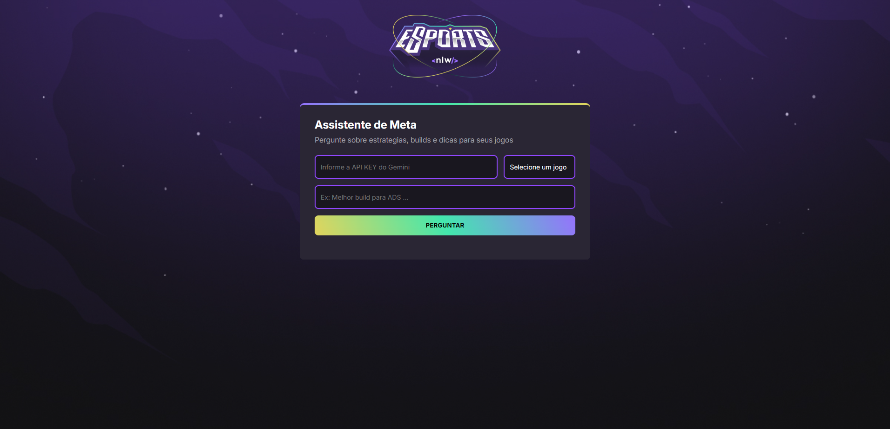

````markdown
# 🧠 Assistente de Meta para Games — NLW Beginner

Este projeto foi desenvolvido durante o evento **Next Level Week - Edição Beginner** da [Rocketseat](https://rocketseat.com.br), com o objetivo de criar uma aplicação web que funciona como **assistente inteligente de meta para jogos populares** como:

- Valorant
- League of Legends (LoL)
- CS:GO
- 7 Days to Die

## 🖼️ Preview

> _Adicione um print da tela aqui:_



---

## ✨ Funcionalidades

- Escolha do jogo desejado por meio de um `<select>`.
- Campo de texto para digitar uma pergunta.
- Integração com a **API do Gemini (Google AI)** para obter respostas específicas de cada jogo.
- Conversão automática de markdown para HTML.
- Interface com animações, tema escuro e design moderno.

---

## 🚀 Tecnologias e Ferramentas Utilizadas

| Tecnologia | Aprendizados                                          |
|------------|--------------------------------------------------------|
| `HTML`     | Estrutura semântica com formulários e elementos acessíveis |
| `CSS`      | Gradientes, responsividade, animações com `@keyframes` |
| `JavaScript` | DOM API, `addEventListener`, `fetch`, `async/await`, manipulação dinâmica de conteúdo |
| `Showdown.js` | Conversão de respostas markdown para HTML |
| `Gemini API` | Envio de prompts personalizados e leitura da resposta da IA |

---

## 📚 O que você aprende com esse projeto

### 🔹 HTML
- Uso de `form`, `input`, `select`, `button` e `section` de forma organizada.
- Aplicação correta de atributos `id`, `placeholder`, `required`, etc.

### 🔹 CSS
- Criação de efeitos de transição com `hover`, `transform`, e `box-shadow`.
- Aplicação de temas com `background-image` e `linear-gradient`.
- Estilização moderna de formulários e animação de entrada (`@keyframes appear`).
- Responsividade com `max-width` e `flex-wrap`.

### 🔹 JavaScript
- Manipulação de elementos HTML com `document.getElementById`.
- Prevenção do comportamento padrão de formulários com `event.preventDefault()`.
- Validação de campos antes do envio.
- Uso de `fetch()` para chamadas HTTP e tratamento assíncrono com `async/await`.
- Geração de prompts dinâmicos baseados no jogo selecionado.
- Conversão de markdown em HTML usando a biblioteca `Showdown`.

---

## 💻 Como executar localmente

```bash
# 1. Clone o repositório
git clone https://github.com/RalphCajazeira/NLW-Beginner

# 2. Acesse a pasta do projeto
cd NLW-Beginner

# 3. Abra o arquivo index.html no navegador
# Dica: use a extensão Live Server no VSCode
````

---

## 🔑 Sobre a API do Gemini

Para que o assistente funcione, é necessário obter uma API Key do [Google AI Gemini](https://aistudio.google.com/app/apikey). Essa chave é informada diretamente no campo do formulário e **não é salva** no código ou em banco de dados, garantindo sua segurança.

---

## 🧪 Exemplos de Perguntas

* “Melhor build para ADS no LoL?”
* “Qual armamento forçar no segundo round no CS\:GO?”
* “Agentes mais fortes no meta do Valorant?”
* “Como upar rápido em 7 Days to Die?”

---

## 📁 Estrutura de Arquivos

```
NLW-Beginner/
├── assets/
│   └── logo.png / bg.jpg
├── index.html       → Estrutura principal do site
├── style.css        → Estilização visual e animações
├── script.js        → Lógica JS e integração com a IA
└── print-do-projeto.png  → (adicione o print aqui)
```

---

## 🙋 Autor

Feito com 💜 por [Ralph Cajazeira](https://github.com/RalphCajazeira) durante o NLW Beginner da Rocketseat.

---

## 🧠 Licença

Este projeto é livre para estudos e fins educativos. Compartilhe, estude e use como base para ideias ainda mais criativas!

```